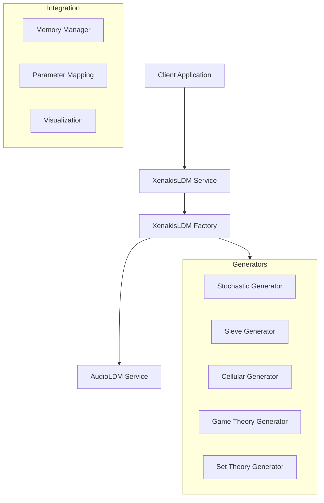

# XenakisLDM Architecture Documentation

## System Overview

The XenakisLDM service integrates mathematical composition techniques with AI-based audio generation. The system is structured in layers:

1. Mathematical Generators Layer
2. Service Integration Layer
3. Audio Generation Layer

### Component Architecture



## Core Components

### 1. Mathematical Generators

#### Stochastic Generator
- Implementation: `StochasticGenerator`
- Distributions: Gaussian, Poisson, Exponential
- Parameter generation with configurable ranges
- Real-time value normalization

#### Sieve Generator
- Implementation: `SieveGenerator`
- Modular arithmetic operations
- Union/intersection operations
- Period-based pattern generation

#### Cellular Generator
- Implementation: `CellularGenerator`
- 1D and 2D rule implementations
- Neighborhood configuration
- Pattern evolution tracking

#### Game Theory Generator
- Implementation: `GameTheoryGenerator`
- Nash equilibrium calculations
- Multiple evolution strategies
- Multi-player parameter interaction

#### Set Theory Generator
- Implementation: `SetTheoryGenerator`
- Pitch class operations
- Musical transformations
- Intervallic relationships

### 2. Service Layer

#### Factory Pattern
- Implementation: `XenakisLDMServiceFactory`
- Singleton service management
- Resource initialization
- Configuration validation

#### Memory Management
- Implementation: `MemoryManager`
- Resource tracking
- Memory usage optimization
- Operation timing

#### Parameter Mapping
- Mathematical to audio parameter conversion
- Range normalization
- Constraint handling
- Multi-parameter relationships

### 3. Integration Layer

#### AudioLDM Integration
- Audio parameter generation
- Quality configuration
- Resource sharing
- Performance optimization

## Data Flow

1. Client Request → Service
   ```typescript
   Task {
     id: string
     type: 'xenakis-generation'
     modelType: 'xenakis'
     data: {
       parameters: XenakisParameters
     }
   }
   ```

2. Service → Generators
   ```typescript
   GeneratorConfig {
     type: GeneratorType
     duration: number
     sampleRate: number
     // Generator-specific parameters
   }
   ```

3. Generators → Parameter Stream
   ```typescript
   ParameterStream {
     parameters: MathematicalParameter[]
     metadata: {
       generator: string
       config: GeneratorConfig
       timestamp: number
     }
   }
   ```

4. Parameter Mapping → AudioLDM
   ```typescript
   AudioGenerationParameters {
     prompt: string
     guidanceScale: number
     diffusionSteps: number
   }
   ```

## Implementation Status

### Completed
✅ Core mathematical generators
✅ Service layer implementation
✅ AudioLDM integration
✅ Testing infrastructure
✅ Development tooling
✅ Documentation

### In Progress
🔄 Performance optimization
🔄 Extended generator features
🔄 Real-time parameter streaming

### Planned
📋 Advanced visualization features
📋 Additional distribution types
📋 Extended musical mappings
📋 User feedback integration

## Performance Goals

### Generation Speed
- Parameter generation: < 100ms
- Audio generation: < 5s per second of audio
- Visualization: < 50ms refresh rate

### Resource Usage
- Memory: < 4GB total
- CPU: < 80% utilization
- GPU: Optional, when available

### Scalability
- Multiple concurrent generators
- Parallel audio generation
- Distributed processing support

## Next Steps

1. **Short Term**
   - Optimize WebAssembly integration
   - Implement caching system
   - Enhance error handling

2. **Medium Term**
   - Add real-time streaming
   - Expand generator capabilities
   - Improve visualization options

3. **Long Term**
   - AI-assisted parameter mapping
   - Advanced musical features
   - Distributed processing
